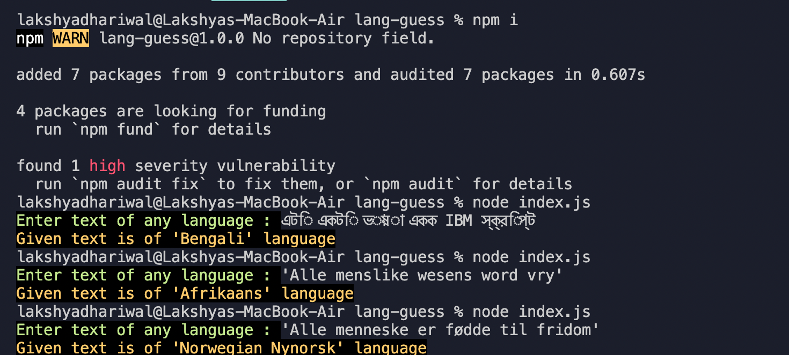

lang-guess
=========

Guesses the language of entered text in CLI.

## Usage
1. clone project
2. run `npm install` to install dependencies.
3. run `node index.js`

## Sample input phrases

'Alle menslike wesens word vry'

'এটি একটি ভাষা একক IBM স্ক্রিপ্ট'

'Alle menneske er fødde til fridom'
---

